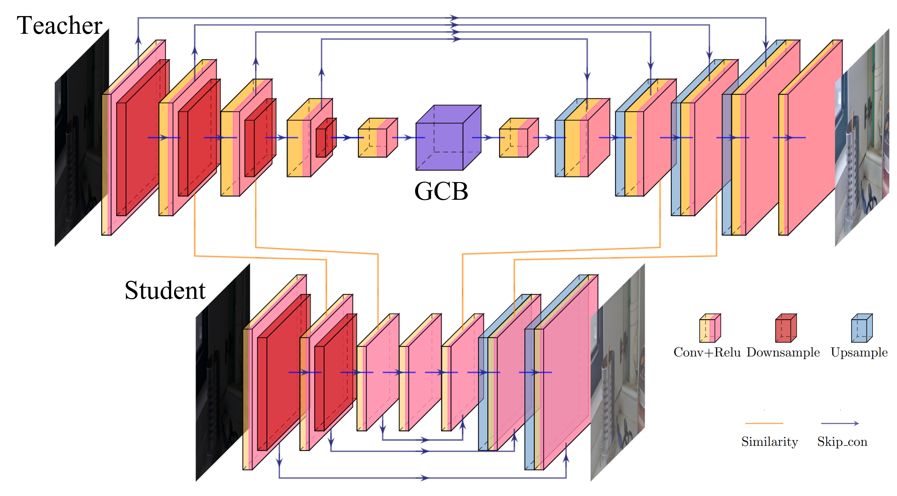
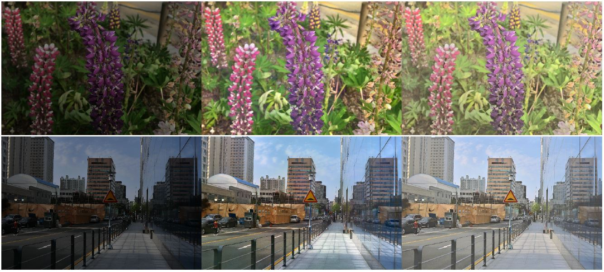

# Learning Lightweight Low-Light Enhancement Network using Pseudo Well-Exposed Images


This repository contains the implementation of the following paper:
>**Learning Lightweight Low-Light Enhancement Network using Pseudo Well-Exposed Images**<br>
>Seonggwan Ko*, Jinsun Park*, Byungjoo Chae and Donghyeon Cho<br>
>IEEE Signal Processing Letters<br>
>[[pdf](https://ieeexplore.ieee.org/abstract/document/9648037)] 
[[dataset](https://cnu365-my.sharepoint.com/:u:/g/personal/gggch414_o_cnu_ac_kr/EQfMUlKNtz5PmwzU2IDTtJMBKd1ZMwpi40FIqWP_nEZUdA?e=1jfhNK)] 
[[StudentNetwork](https://github.com/gggch414/LLKD/tree/main/llkd/snapshots)]
[TeacherNetwork(Coming Soon)] <br>


# Overview
<p align="center">

<p>


## Visual results
<p align="center">

<p>

## Requirements
The following packages must be installed to perform the proposed model:
- PyTorch 1.7.1
- torchvision 0.8.2
- Pillow 8.2.0
- TensorBoardX 2.2
- tqdm


## Test 
Test datasets should be arranged as the following folder `dataset/test`.
```bash
dataset
│   ├── test
│   │   ├── LIME
│   │   ├── LOL
│   │   ├── DICM
│   │   └── ...
└── ...
```
If you set up the folder, you can make it run.
```
python test.py
```

## Train
To train the proposed model, the following options are required:
```
python train.py --lowlight_images_path 'your_dataset_path' --gt_images_path 'your_GT_dataset_path' --pretrain_dir  'your_pretrain_path'
```

`lowlight_images_path` is the path of your low-light image

`gt_images_path` is the path of your ground-truth image

`pretrain_dir` is the path of your pretrained teacher model path

# Dataset
<p align="center">

<p>
We provide 9,983 training pairs and 366 test images.

Please click [here](https://cnu365-my.sharepoint.com/:u:/g/personal/gggch414_o_cnu_ac_kr/EQfMUlKNtz5PmwzU2IDTtJMBKd1ZMwpi40FIqWP_nEZUdA?e=1jfhNK) to download Low-light CNU(LLCNU) dataset.

## Dataset Creation
- We collected 25,967 low-light images from [BDD100k](https://doc.bdd100k.com/download.html)(4,830 images) and [Dark Zurich](https://www.trace.ethz.ch/publications/2019/GCMA_UIoU/)(5,336 images), [LoLi-Phone(now LLIV)](https://drive.google.com/file/d/1QS4FgT5aTQNYy-eHZ_A89rLoZgx_iysR/view)(6,442 images), [ExDark](https://github.com/cs-chan/Exclusively-Dark-Image-Dataset/tree/master/Dataset)(7,263 images), [SICE](https://github.com/csjcai/SICE)(1,611), [LOL](https://drive.google.com/file/d/157bjO1_cFuSd0HWDUuAmcHRJDVyWpOxB/view)(485 images).
- Then, we generate pseudo well-exposed images using the pretrained EnlightenGAN, and additionally reduce noise using DnCNN.


## Citation
```
@article{ko2021learning,
  title={Learning Lightweight Low-Light Enhancement Network using Pseudo Well-Exposed Images},
  author={Ko, Seonggwan and Park, Jinsun and Chae, Byungjoo and Cho, Donghyeon},
  journal={IEEE Signal Processing Letters},
  year={2021},
  publisher={IEEE}
}
```


## License and Acknowledgement
The code framework is mainly modified from [Zero-DCE](https://github.com/Li-Chongyi/Zero-DCE), [AdaBelief](https://github.com/juntang-zhuang/Adabelief-Optimizer) and [SPKD](https://github.com/DongGeun-Yoon/SPKD). Please refer to the original repo for more usage and documents.
Thanks to authors for sharing the codes!


